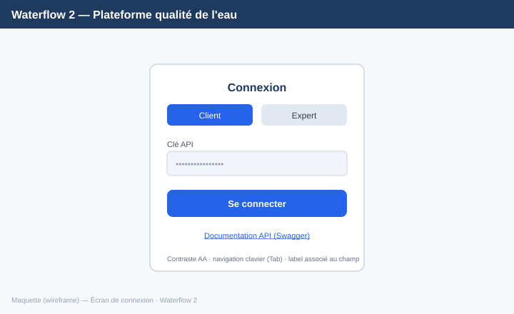
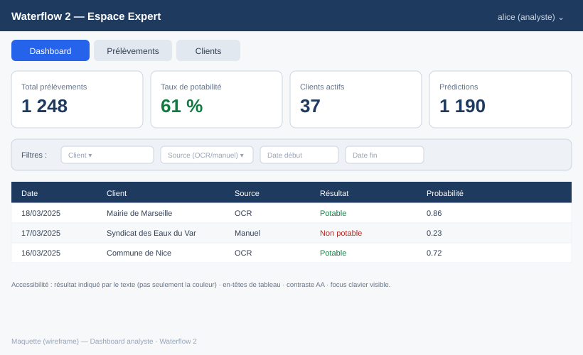

# Maquettes & mini cahier des charges UI — Waterflow 2 (compétence C17)

> Maquettes basse-fidélité (wireframes) de l'interface web experts + mini-CDC
> précisant les critères que l'application doit respecter. L'app réelle
> (`templates/index.html`) **adhère** à ces maquettes.

---

## 1. Wireframes

### Écran de connexion

- Deux onglets d'authentification : **Client** (clé API) / **Expert** (token Bearer).
- Un seul champ + un bouton d'action clair. Lien vers la documentation Swagger.

### Dashboard analyste

- Barre de navigation (Dashboard / Prélèvements / Clients) selon le rôle.
- 4 cartes **KPI** (total prélèvements, taux de potabilité, clients actifs, prédictions).
- Barre de **filtres** (client, source, période).
- **Tableau** paginé des prélèvements (date, client, source, résultat, probabilité).

---

## 2. Mini cahier des charges (critères de l'UI)

| # | Exigence | Vérifiable par |
|---|---|---|
| CDC-1 | La page de connexion propose Client (clé API) et Expert (token) | Onglets présents |
| CDC-2 | Après connexion, l'onglet affiché dépend du **rôle** (analyste vs exploit) | Onglets Audit/Métriques masqués pour analyste |
| CDC-3 | Le dashboard affiche au moins 4 KPI agrégés | Cartes chiffrées |
| CDC-4 | Les prélèvements sont **filtrables** (client, source, date) | Barre de filtres fonctionnelle |
| CDC-5 | Un client ne voit **que ses** données (isolation) | Périmètre appliqué côté API |
| CDC-6 | Le résultat de potabilité n'est **pas porté par la seule couleur** | Libellé texte « Potable / Non potable » |

---

## 3. Objectifs d'accessibilité (standard : WCAG 2.1 niveau AA / RGAA)

| Critère WCAG/RGAA | Application dans l'UI |
|---|---|
| **1.4.3** Contraste (AA) | Texte foncé sur fond clair, ratio ≥ 4.5:1 |
| **1.4.1** Usage de la couleur | Résultat indiqué par **texte + couleur** (jamais couleur seule) |
| **2.1.1** Clavier | Navigation complète au **Tab**, focus visible |
| **1.3.1** Info et relations | En-têtes de tableau `<th>`, labels associés aux champs |
| **2.4.2** Titre de page | Titre explicite (« Waterflow 2 — Espace Expert ») |
| **4.1.2** Nom, rôle, valeur | Attributs ARIA sur les composants interactifs (onglets, boutons) |

> Ces critères sont repris dans les **critères d'acceptation des user stories**
> (voir `user_stories.md`, section Accessibilité).

---

*Maquettes & mini-CDC — Waterflow 2 · B3 IA 2025*
